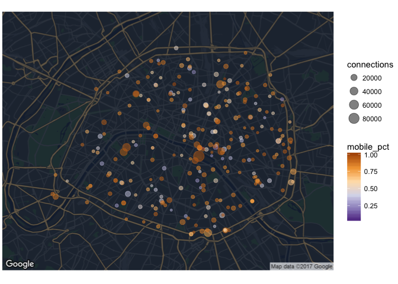

# Wifi Paris Analysis for Year 2016
Charles de Lassence  

# Project

The city of Paris has released a dataset containing a list of all connections made in 2016 on the ~300 public wifi hotspots, available on their [open data website](https://opendata.paris.fr/explore/dataset/utilisations_mensuelles_des_hotspots_paris_wi-fi/information/). I have explored this dataset to find insights about connection behaviours, and to infer 


# Results


# Code

## Preparing data

### Setup and libraries


```r
library("tidyverse")
library("stringr")
library("corrplot")
library("ggmap")
library("lubridate")
library("knitr")
```

### Load and format main file

```r
wifi.raw <- read_delim("./wifi-data-2016.csv",
                       delim = ";", na = c("NULL", ""), col_types = "ccnnnccccc",
                       progress = FALSE)
```


```r
wifi.2 <- 
    wifi.raw %>%
    mutate(start_time = as_datetime(str_replace(start_time, "T", " ")),
           stop_time = as_datetime(str_replace(stop_time, "T", " "))) %>%
    mutate(input_mo = round(input_octets/1024^2, 2),
           output_mo = round(output_octets/1024^2, 2),
           language = str_match(langue, "([a-z]{2})?_?([A-Z]{2})?")[,2],
           country = str_match(langue, "([a-z]{2})?_?([A-Z]{2})?")[,3]) %>%
    select(-c(input_octets, output_octets)) %>%
    arrange(start_time)
```


```r
wifi <- wifi.2
```


### Adding new features

We will compute new features based on the current information we have, in order
to improve our analysis.  

First, let's simplify all OS into fewer, clean categories


```r
# Get OS Type
wifi <- 
    wifi %>%
    mutate(os_type =
           if_else(str_detect(os, "(Debian|Fedora|Mageia|MeeGo|Ubuntu|BSD)"),
                   "Linux",
                   if_else(str_detect(os, "(Windows|Mac OS|Linux|Chrome OS|Kindle|Black[Bb]erry|iOS|Android)"),
                           str_extract(os, "(Windows|Mac OS|Linux|Chrome OS|Kindle|Black[Bb]erry|iOS|Android)"),
                           "Other")
                   )
           )
```

Then, let's extract the device brand, based on the OS (for Apple), or the full device name.


```r
# Get Device Brand
wifi <- 
    wifi %>%
    mutate(device_brand =
           if_else(os %in% c("iOS", "Mac OS X"), "Apple", 
                   case_when(str_detect(device, "^L-EMENT") ~ "Logicom",
                             str_detect(device, "Kindle") ~ "Amazon",
                             TRUE ~ str_to_title(str_sub(str_extract(device, "^[:alpha:]{2,}[ -]"), end = -2))
                             )
                   )
           )
```

Finally, let's guess if the device is a Computer or a Mobile/Tablet


```r
# Get Type of Device
wifi <-
    wifi %>%
    mutate(device_type =
           if_else(str_detect(browser, "Mobile"),
                   "Mobile/Tablet",
                   if_else(str_detect(os, "(Mobile|Phone|Bada|Symbian)"),
                           "Mobile/Tablet",
                           if_else(str_detect(os_type, "(Android|Blackberry|iOS)"),
                                   "Mobile/Tablet",
                           if_else(str_detect(os_type, "(Windows|Linux|Mac OS)"),
                                   "Computer", ""), 
                           ""),
                           ""),
                   "")
           )
wifi$device_type[wifi$device_type == ""] <- NA
```

### Join with map of hotspots

As the location of the hotspots is in a different source, we need to join it with our main dataframe. But we first have to do some cleaning on the names of the sites, that are sometimes misspelled.


```r
# Load map of hotspots
wifi.map <- read_csv2("./wifi-hotspots-list.csv")
names(wifi.map) <- c("Id", "Nom", "Address", "CP", "City", "GeoPoint")

# Join, using semi-manually cleaned correspondance file
wifi.map <-
    read_csv("./wifi-hotspots-list-clean.csv") %>%
    left_join(wifi.map, by = c("Id" = "Id")) %>%
    select(site_key = Site.1, site_clean = Site.Clean, site_id = Id, site_xy = GeoPoint) %>%
    filter(!is.na(site_xy)) %>%
    separate(site_xy, into = c("site_geo_y", "site_geo_x"), 
             sep = ", ", convert = TRUE)

# Create hotspot coordinate table, for later use
wifi.corresp <-
    wifi.map %>%
    select(site_id, site_clean, site_geo_x, site_geo_y) %>%
    rename(site = site_clean) %>%
    distinct()
```


```r
# Join main dataframe with the clean hotspot mapping
wifi <-
    wifi %>%
    left_join(wifi.map, by = c("site" = "site_key")) %>%
    select(-site) %>%
    rename(site = site_clean)
```

## Analysis

### Most popular hotspots

Let's first look at the most used hotspots, in terms of number of connections and output volume (in Mo).


```r
graph_popular <- 
    wifi %>% 
    filter(!is.na(site_id)) %>%
    group_by(site_id, site) %>% 
    summarise(connections = n(), 
              avg_volume = sum(output_mo) / connections) %>% 
    arrange(desc(connections)) %>%
    left_join(wifi.corresp) %>%
    ungroup()

graph_popular %>%
    select(site, connections, avg_volume) %>%
    head(10) %>%
    kable(col.names = c("Site", "Connections", "Average volume (Mo)"),
          digits = 2)
```


Site                                            Connections   Average volume (Mo)
---------------------------------------------  ------------  --------------------
Square Jean XXIII                                     91691                  3.85
Centre d'Accueil Kellermann                           45496                  7.04
Berges de Seine Rive Gauche - Gros Caillou            40797                  2.88
Jardin d'Eole 1                                       38778                  5.72
Bibliothèque Historique de la Ville de Paris          33443                  5.17
Parc Champs de Mars                                   32459                  3.55
Bibliothèque Yourcenar                                32134                  4.49
Square Louis XIII                                     30718                  2.60
Médiathèque Marguerite Duras                          27730                  4.16
Parc Monceau 1 (Entrée)                               23743                  3.60


The most popular hotspot is the square just behind the Notre-Dame cathedral, which is a very touristic area, so this result does not come as a surprise. 

We can draw the full results on a map.


```r
# Define a map style and save it for later
googlemap.style <- "style=element:geometry%7Ccolor:0x242f3e&style=element:labels%7Cvisibility:off&style=feature:administrative.land_parcel%7Cvisibility:off&style=feature:administrative.neighborhood%7Cvisibility:off&style=feature:poi.park%7Celement:geometry%7Ccolor:0x263c3f&style=feature:road%7Celement:geometry%7Ccolor:0x38414e&style=feature:road%7Celement:geometry.stroke%7Ccolor:0x212a37&style=feature:road.highway%7Celement:geometry%7Ccolor:0x746855&style=feature:road.highway%7Celement:geometry.stroke%7Ccolor:0x1f2835&style=feature:transit%7Celement:geometry%7Ccolor:0x2f3948&style=feature:water%7Celement:geometry%7Ccolor:0x17263c"

googlemap.graph <- 
    get_googlemap(center = c(lon = 2.33, lat = 48.86), zoom = 12, 
                  size = c(640, 500), scale = 2, maptype = "roadmap", 
                  style = googlemap.style)
```


```r
# Plot hotspots by volume
ggmap(googlemap.graph) + theme_void() +
      geom_point(data = graph_popular, colour = "yellow",
                 aes(x = site_geo_x, y = site_geo_y, size = connections, 
                     alpha = avg_volume))
```

<!-- -->


### Top languages

```r
# Top 10 languages
wifi %>%
    group_by(language) %>%
    summarise(percent = n() / nrow(wifi) * 100) %>%
    arrange(desc(percent)) %>%
    filter(!is.na(language)) %>%
    top_n(10) %>%
    kable(col.names = c("Language", "Share %"), digits = 1)
```


Language    Share %
---------  --------
fr             46.0
en             15.1
es              3.2
it              1.8
de              1.5
ar              1.3
pt              1.3
ru              1.1
zh              1.0
nl              0.8

French represents only less than half of the connections on public wifi, followed by English. 


```r
graph_language <-
    wifi %>%
    filter(!is.na(site_id)) %>%
    group_by(site_id, language) %>%
    summarise(connections = n()) %>%
    ungroup() %>%
    group_by(site_id) %>%
    mutate(lang_pct = round(connections / sum(connections), 4),
           total_count = sum(connections)) %>%
    arrange(site_id, desc(connections)) %>%
    filter(!is.na(language)) %>%
    top_n(n = 1, wt = lang_pct) %>%
    left_join(wifi.corresp)
```


```r
ggmap(googlemap.graph) + theme_void() +
    geom_point(data = graph_language,
               aes(x = site_geo_x, y = site_geo_y, size = connections,
                   colour = language, alpha = lang_pct))
```

<!-- -->

The map above shows the most used language by hotspot. While most are French, a number of mostly touristic areas have more devices set to English. There is also one hotspot (in the 18th district) where the most frequent language is Arabic.


```r
graph_language %>%
    ungroup() %>%
    filter(language != "fr", total_count > 5000) %>%
    arrange(desc(total_count)) %>%
    transmute(site, language, lang_pct * 100, total_count) %>%
    kable(col.names = c("Site", "Language", "Language Share %", "Site Connections"))
```


Site                                         Language    Language Share %   Site Connections
-------------------------------------------  ---------  -----------------  -----------------
Square Jean XXIII                            en                     39.12              91691
Berges de Seine Rive Gauche - Gros Caillou   en                     29.69              40797
Jardin d'Eole 1                              ar                     38.64              38778
Parc Champs de Mars                          en                     34.79              32459
Square Louis XIII                            en                     30.85              30718
Square Rene Viviani                          en                     42.92              19583
Musee du Petit Palais                        en                     37.09              18692
Parvis de L'Hôtel de Ville (Seine)           en                     30.88              10203
Jardin d'Eole 2                              en                     42.00               8276
Berges de Seine Rive Gauche - Solferino      en                     37.69               6286

### Connections per day and hour


```r
# Weekday and hour
graph_weekday_hour <-
    wifi %>%
    mutate(weekday = wday(start_time, label = TRUE),
           hour = hour(start_time)) %>%
    group_by(weekday, hour) %>%
    summarise(connections = n())
```


```r
ggplot(graph_weekday_hour, aes(hour, weekday, fill = connections)) +
    geom_tile() +
    # coord_polar(theta = "y") +
    scale_fill_distiller(palette = "Blues", direction = 1)
```

<!-- -->

Looking at the number of connections per weekday and hour, we see a classic pattern during daytime. However there is a strange drop of connections on Monday, that we wouldn't expect.


```r
# Every day of the year
graph_dayofyear <-
    wifi %>%
    mutate(day = day(start_time),
           month = month(start_time, label = TRUE)) %>%
    group_by(month, day) %>%
    summarise(connections = n())
```


```r
ggplot(graph_dayofyear, aes(day, month)) +
    geom_raster(aes(fill = connections)) +
    scale_fill_distiller(palette = "Blues", direction = 1)
```

<!-- -->

When we plot the same figures by day of the year 2016, we see that there is a problem in the data: no connections have been recorded on the first 3 days of April through March, while there is are much more connections on 4-12 Janury to March. There is obviously a mixup in the dates, months and days have probably been inverted for 1-3 April to 1-3 December.  

### Mobile vs Computer

On average, 67% of all connections are made on Mobile/Tablet. 
But where do people use mobiles/tablets and computers the most ?


```r
graph_device_type <-
    wifi %>%
    filter(!is.na(site_id)) %>%
    # filter(device_type %in% c("Mobile/Tablet", "Computer")) %>%
    group_by(site_id, device_type) %>%
    summarise(connections = n()) %>%
    mutate(mobile_pct = connections / sum(connections)) %>%
    filter(device_type == "Mobile/Tablet") %>%
    left_join(wifi.corresp) %>%
    ungroup()
```


```r
graph_device_type %>%
    select(site, connections, mobile_pct) %>%
    mutate(mobile_pct = mobile_pct * 100) %>%
    filter(connections > 5000) %>%
    arrange(desc(mobile_pct)) %>%
    head(10) %>% 
    kable(col.names = c("Site", "Connections", "Mobile share"),
          digits = 1, caption = "Hotspots with high Mobile/Tablet share")
```


Table: Hotspots with high Mobile/Tablet share

Site                                          Connections   Mobile share
-------------------------------------------  ------------  -------------
Parvis de L'Hôtel de Ville (9_place)                 5309           94.6
Square Jean XXIII                                   86610           94.5
Square Louis XIII                                   28964           94.3
Parc Champs de Mars                                 30468           93.9
Berges de Seine Rive Gauche - Solferino              5889           93.7
Square Rene Viviani                                 18345           93.7
Berges de Seine Rive Gauche - Gros Caillou          37985           93.1
Jardin d'acclimatation                               7982           92.9
Place de la république coté Ouest                    9342           92.2
Musee du Petit Palais                               17150           91.8


```r
graph_device_type %>%
    select(site, connections, mobile_pct) %>%
    mutate(mobile_pct = mobile_pct * 100) %>%
    filter(connections > 5000) %>%
    arrange(mobile_pct) %>%
    head(10) %>%
    kable(col.names = c("Site", "Connections", "Mobile share"),
          digits = 1, caption = "Hotspots with high Computer share")
```


Table: Hotspots with high Computer share

Site                                            Connections   Mobile share
---------------------------------------------  ------------  -------------
Bibliothèque Historique de la Ville de Paris           6978           20.9
Médiathèque Marguerite Duras                           9421           34.0
Bibliothèque Yourcenar                                12378           38.5
Maison Initiatives Etudiantes                          7760           40.2
Bibliothèque Trocadero                                 5128           41.1
Bibliothèque Francois Truffaut                         6257           44.5
Mediatheque Francoise Sagan 1 sur 2                    8506           44.7
Bibliothèque Jean Pierre Melville                      9501           45.0
Hôtel de Ville 4 (3eme etage)                          7321           45.4
Bibliothèque Vaclav Havel                              6130           53.2

Let's recap this on a map, with the color indicating if the hotspot is used more by Mobiles or Computers.


```r
ggmap(googlemap.graph) + theme_void() +
      geom_point(data = graph_device_type,
                 aes(x = site_geo_x, y = site_geo_y, size = connections,
                     colour = mobile_pct), alpha = 0.5) +
      scale_colour_distiller(type = "div", palette = 4)
```

<!-- -->

### Preferred brands

Note that about 27% of connections do not have a country indication from the device, and that we have identified only 67% of devices brands. However, this still leaves us with 1.1M connections to analyse.


```r
graph_device_brands <-
    wifi %>%
    group_by(device_brand, device_type) %>%
    summarise(percent = (n() / nrow(wifi)) * 100) %>%
    arrange(desc(percent)) %>% 
    filter(!is.na(device_brand) & !is.na(device_type))

kable(head(graph_device_brands, 10), digits = 1,
      col.names = c("Brand", "Device Type", "Share %"))
```


Brand       Device Type      Share %
----------  --------------  --------
Apple       Mobile/Tablet       28.7
Samsung     Mobile/Tablet       17.3
Apple       Computer             9.3
Lg          Mobile/Tablet        1.2
Lumia       Mobile/Tablet        1.1
Htc         Mobile/Tablet        0.9
Generic     Mobile/Tablet        0.8
Huawei      Mobile/Tablet        0.8
Microsoft   Mobile/Tablet        0.6
Asus        Mobile/Tablet        0.5

Apple is clearly leading the way, with 28% share of devices, both mobile and computers, followed by Samsung. All other brands are below 2%.
